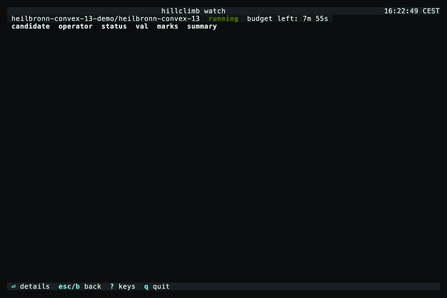

<div align="center">

<picture>
  <source media="(prefers-color-scheme: dark)" srcset="docs/assets/hillclimb-logo.svg">
  
</picture>

**Hillclimbing on verifiable rewards.**<br>
Use Claude Code and Codex to autonomously search for python programs that optimize a score you define.

<picture>
  <source media="(prefers-color-scheme: dark)" srcset="docs/assets/hillclimb-mountain-dark.png">
  
</picture>

[Website](https://hillclimb.sh) ·
[Docs](https://docs.hillclimb.sh) ·
[Quickstart](https://docs.hillclimb.sh/quickstart) ·
[CLI reference](https://docs.hillclimb.sh/cli) ·
[Blog](https://docs.hillclimb.sh/blogposts) ·
[Discord](https://discord.gg/DDKh9UtSH)

[](https://pypi.org/project/hillclimb/)
[](https://pypi.org/project/hillclimb/)
[](https://github.com/rebase-energy/hillclimb/actions/workflows/quickstart.yml)
[](LICENSE)
[](https://discord.gg/DDKh9UtSH)

</div>

---

`hillclimb` provides a modular harness, tooling and testbed for exploring and
benchmarking program search algorithms. The goal is to help discover better
autoresearch methods, rather than build a single best autoresearcher.

You provide a verifier script, `verifier.sh`, and (optionally) a starting
solution, `solution.py`. `hillclimb` then spends a compute budget running a
search policy — a [climber](https://docs.hillclimb.sh/python/climber) — that
decides which version to build on next and dispatches headless coding agents
to write, debug and improve it. Each version is scored through your verifier,
and `hillclimb` keeps the one that scores best.

The harness is fixed. The **climber** — what to try next and how each attempt
is prompted — is a block you can swap, edit and share, so two methods can be
compared on the same problem under the same budget.

## Quickstart

```bash
pip install hillclimb                      # or: uv tool install hillclimb
hillclimb connect claude                   # or codex, pi, openrouter; add --agent dummy to any run for no LLM at all

hillclimb init                             # hillclimb.yaml, problems/, runs/ in this folder
hillclimb problem get heilbronn-convex-13  # the verifier is the problem; description.md is the brief
hillclimb verify heilbronn-convex-13       # score the floor solution

hillclimb run heilbronn-convex-13 --budget 10m
hillclimb watch                            # live coding agents and scores (also: chart, tree)
hillclimb stop --all
hillclimb summit                           # copy the best solution.py into this folder
```

<p align="center">
  
</p>

Every search also keeps its best in `runs/<run-id>/searches/<search-id>/best/`.
The [walkthrough](https://docs.hillclimb.sh/walkthrough) goes through each step.

## What is hillclimb for?

Anything you can phrase as: a program or artifact in, a number out, and a
verifier that computes a number/score (potentially using data the agents never
seen). Some problem types that are well suited for `hillclimb`:

| Problem type | What Hillclimb improves |
| --- | --- |
| Optimization | Packing, routing and scheduling solutions, scored by solution quality, cost or constraint violations. |
| Prediction and forecasting | Training and prediction code, evaluated on hidden data using metrics such as MAE, pinball loss or CRPS. |
| Performance engineering | Code for a fixed workload, scored by runtime, memory use, binary size or another resource constraint. |
| Parameter fitting | Estimation code that recovers unknown parameters, tested against cases with known ground truth. |
| Strategies and policies | Dispatch, bidding and cache-eviction strategies, evaluated by replaying historical or simulated scenarios. |
| Generated artifacts | SQL queries, regular expressions, solver configurations and prompts—anything that can be generated and scored. |
| Mathematical discovery | Constructions, counterexamples and bounds, scored by a programmatically verifiable mathematical objective. |

**Where it fits poorly.** The search loop needs many candidates per budget so
verifiers that takes hours to run are not a great match with `hillclimb`.
Objectives without a scalar score, like UX, prose or "nicer code". Pass/fail
verifiers with no partial credit, since a 0/1 score gives the search nothing to
climb. Low-dimensional continuous optimisation, where a numerical optimiser is
the better tool.

## Climbers

A climber is five modules, run in this order at every step of a search. Each
one is a built-in or a Python file you can edit.

| Module | Decides | Built in |
| --- | --- | --- |
| `selector_policy` | which candidate the next attempt builds on | `best`, `map-elites` |
| `operator_policy` | which operator to apply to it | `greedy` |
| `operators` | how one attempt is made: the prompt the coding agent gets | `draft`, `debug`, `improve`, `ensemble` |
| `tuner` | which parameter values to try on a candidate | `random`, `optuna` |
| `memory` | what carries over from one search to the next | `files`, `none` |

Together they are one block of config, in a run spec or as the folder's default
in `hillclimb.yaml`:

```yaml
climber:
  selector_policy: map-elites     # which candidate to build on next
  operator_policy: greedy         # which operator to use on it
  operators: [draft, debug, improve, crossover.py:Crossover]
  tuner: optuna
  memory: files
  params: {num_drafts: 5}
```

Every slot takes a prebuilt module, a `.py` file of your own, or
`package.module:Class`. Presets: `greedy`, `openevolve`, `gepa`. Or compose in
Python:

```python
from hillclimb import Budget, Climber, Problem
from hillclimb.policies import Greedy
from hillclimb.selectors import MapElites

problem = Problem("heilbronn-convex-13")
budget = Budget(wall_clock="10m", evaluations=40)
climber = Climber(selector_policy=MapElites(num_drafts=5), operator_policy=Greedy())

climber.search(problem, budget=budget)
climber.best, climber.history, climber.to_frame()
```

`MapElites` and the `openevolve` preset need `pip install 'hillclimb[openevolve]'`,
`tuner: optuna` needs `'hillclimb[optuna]'` and `gepa` needs `'hillclimb[gepa]'`.

`climber.start(...)` opens the same search to drive by hand, one `climber.step()` at a
time, and `Problem(name, score=my_function, ...)` defines a problem from a scoring function.
Runnable scripts are in [`examples/`](examples/).

Compare two head to head:

```bash
hillclimb run heilbronn-convex-13 --climber greedy --climber openevolve   # one search each; --parallel-searches 3 runs three of each
hillclimb experiment report <run-id>
```

## Example problems

Exact, noise-free construction problems, each with its best known value as the
target line. `hillclimb problem list` shows the full catalog.

| Family | Instances | Score |
|---|---|---|
| Circle packing | `circle-packing`, `circle-packing-32` | sum of radii ↑ |
| Heilbronn triangles | `heilbronn-11`, `-14`, `-17`, `heilbronn-convex-13` | smallest triangle ↑ |
| Low-autocorrelation sequences | `labs-40`, `labs-60` | sidelobe energy ↓ |
| Tammes / Thomson | `tammes-30`, `-50`, `thomson-50`, `-100` | min angle ↑ / energy ↓ |
| Autocorrelation inequalities | `autocorr-1`, `autocorr-3`, `erdos-overlap` | the constant ↓ |
| Kissing configuration | `kissing-11` | points ↑ |
| Golomb rulers | `golomb-20`, `golomb-27` | length ↓ |
| TSP / knapsack | `tsp-200`, `mknap-100-5`, `mknap-250-10` | tour ↓ / value ↑ |

[Define your own](https://docs.hillclimb.sh/problems): `hillclimb problem new
my-problem` writes a small problem that already runs, for you to edit into yours. Kaggle (MLE-bench) and Einstein Arena
come in as [benchmark problems](https://docs.hillclimb.sh/benchmarks).

## Learn more

<table>
<tr>
<td width="50%" valign="top">

### [Website →](https://hillclimb.sh)

What hillclimb is for, the terminal views you watch a climb in, and the
modules a climber is built from.

</td>
<td width="50%" valign="top">

### [Problems →](https://docs.hillclimb.sh/examples)

Every example problem with its verifier, its best known value and who found
it, plus the [verifier contract](https://docs.hillclimb.sh/problems/verifier-contract).

</td>
</tr>
<tr>
<td width="50%" valign="top">

### [CLI reference →](https://docs.hillclimb.sh/cli)

Every `hillclimb` command and its flags, from `run` and `watch` to
`experiment` and `climber check`.

</td>
<td width="50%" valign="top">

### [Blogposts →](https://docs.hillclimb.sh/blogposts)

Starting with [Hillclimbing on verifiable rewards](https://docs.hillclimb.sh/blogposts/hillclimbing-on-verifiable-rewards):
from Cauchy's gradient descent to LLMs searching over programs.

</td>
</tr>
</table>

Questions, results, ideas: [join the Discord](https://discord.gg/DDKh9UtSH).

## License

[MIT](LICENSE)
