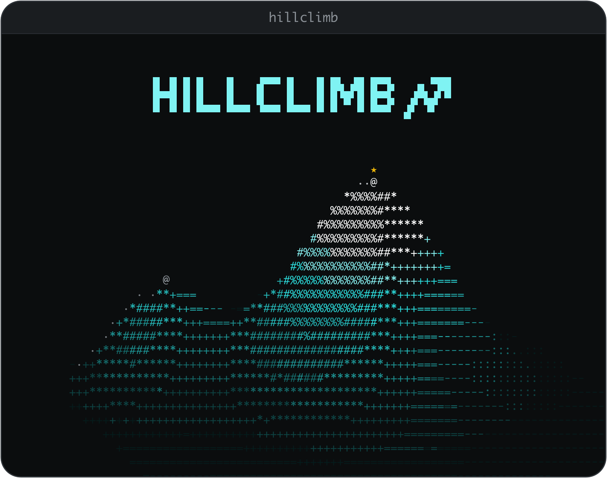

<div align="center">



**Hillclimbing on verifiable rewards.**<br>
Use Claude Code and Codex to autonomously search for python programs that optimize a score you define.

[Website](https://hillclimb.sh) ·
[Docs](https://docs.hillclimb.sh) ·
[Quickstart](https://docs.hillclimb.sh/quickstart) ·
[CLI reference](https://docs.hillclimb.sh/cli) ·
[Blog](https://docs.hillclimb.sh/blogposts) ·
[Discord](https://discord.gg/DDKh9UtSH)

[](https://pypi.org/project/hillclimb/)
[](https://pypi.org/project/hillclimb/)
[](https://github.com/rebase-energy/hillclimb/actions/workflows/quickstart.yml)
[](LICENSE)
[](https://discord.gg/DDKh9UtSH)

</div>

---

Give hillclimb a **problem** — a folder whose verifier scores a `solution.py` —
and a budget. It runs Claude Code, Codex or pi as operators that draft, debug
and improve solutions, scores every candidate through your verifier, and keeps
the best.

The harness is fixed. The **climber** — what to try next and how each attempt
is prompted — is a block you can swap, edit and share, so two methods can be
compared on the same problem under the same budget.

## Quickstart

```bash
pip install hillclimb
hillclimb connect claude               # or codex, pi; add --agent dummy to any run for no LLM at all

hillclimb init                         # hillclimb.yaml, problems/, runs/ in this folder
hillclimb problem get heilbronn-11     # the verifier is the problem; description.md is the brief
hillclimb verify heilbronn-11          # score the floor solution

hillclimb run heilbronn-11 --budget 10m
hillclimb watch                        # live agents and scores (also: chart, tree)
hillclimb stop --all
```

The best solution lands in `runs/<run-id>/searches/heilbronn-11/best/`.
The [walkthrough](https://docs.hillclimb.sh/walkthrough) goes through each step.

## Climbers

A climber is one block of config, in a run spec or as the folder's default in
`hillclimb.yaml`:

```yaml
climber:
  policy: greedy                  # what to try next
  select: map-elites              # which candidate to expand
  operators: [draft, debug, improve, crossover.py:Crossover]
  tuner: optuna
  params: {num_drafts: 5}
```

Every slot takes a prebuilt module, a `.py` file of your own, or
`package.module:Class`. Presets: `greedy`, `openevolve`, `gepa`. Or compose in
Python:

```python
import hillclimb as hc

climber = hc.Climber(policy=hc.policies.Greedy(num_drafts=5), select=hc.selectors.MapElites())
hc.run("heilbronn-11", climber=climber, budget="10m")
```

Compare two head to head:

```bash
hillclimb run heilbronn-11 --climber greedy --climber openevolve --parallel-searches 2
hillclimb experiment report <run-id>
```

## Example problems

Exact, noise-free construction problems, each with its best known value as the
target line. `hillclimb problem list` shows the full catalog.

| Family | Instances | Score |
|---|---|---|
| Circle packing | `circle-packing`, `circle-packing-32` | sum of radii ↑ |
| Heilbronn triangles | `heilbronn-11`, `-14`, `-17`, `heilbronn-convex-13` | smallest triangle ↑ |
| Low-autocorrelation sequences | `labs-40`, `labs-60` | sidelobe energy ↓ |
| Tammes / Thomson | `tammes-30`, `-50`, `thomson-50`, `-100` | min angle ↑ / energy ↓ |
| Autocorrelation inequalities | `autocorr-1`, `autocorr-3`, `erdos-overlap` | the constant ↓ |
| Kissing configuration | `kissing-11` | points ↑ |
| Golomb rulers | `golomb-20`, `golomb-27` | length ↓ |
| TSP / knapsack | `tsp-200`, `mknap-100-5`, `mknap-250-10` | tour ↓ / value ↑ |

[Define your own](https://docs.hillclimb.sh/problems/defining-problems) by
copying one and editing `verify.py`. Kaggle (MLE-bench), energy forecasting
(emflow) and Einstein Arena come in as
[benchmark problems](https://docs.hillclimb.sh/benchmarks).

## Learn more

<table>
<tr>
<td width="50%" valign="top">

### [Website →](https://hillclimb.sh)

What hillclimb is for, the terminal views you watch a climb in, and the
modules a climber is built from.

</td>
<td width="50%" valign="top">

### [Problems →](https://docs.hillclimb.sh/examples)

Every example problem with its verifier, its best known value and who found
it, plus the [verifier contract](https://docs.hillclimb.sh/problems/verifier-contract).

</td>
</tr>
<tr>
<td width="50%" valign="top">

### [CLI reference →](https://docs.hillclimb.sh/cli)

Every `hillclimb` command and its flags, from `run` and `watch` to
`experiment` and `climber check`.

</td>
<td width="50%" valign="top">

### [Blogposts →](https://docs.hillclimb.sh/blogposts)

Starting with [Hillclimbing on verifiable rewards](https://docs.hillclimb.sh/blogposts/hillclimbing-on-verifiable-rewards):
from Cauchy's gradient descent to LLMs searching over programs.

</td>
</tr>
</table>

Questions, results, ideas: [join the Discord](https://discord.gg/DDKh9UtSH).

## License

[MIT](LICENSE)
