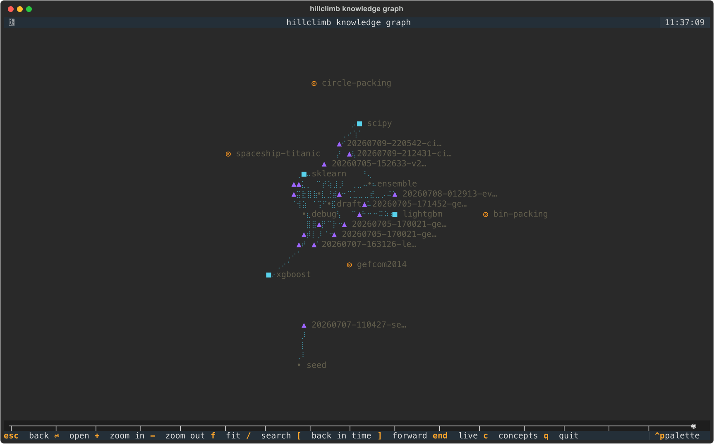

# Operators and memory

How each attempt is prompted and routed, and what hillclimb remembers across searches.

## Operator scaffolds and model routing

Two prompt scaffolds sharpen the default operators (both on by default; they
are params of the operators — `operator_params: {draft: {retrieval: false},
improve: {ablation: false}}` in the climber's block, or `--set
climber.operators.draft.retrieval=false`; both gate prompt injection only,
so A/B experiments record identical data):

- **Retrieval-augmented draft** (`climber.operators.draft.retrieval`) — the draft
  coding agent is told to web-search the current state of the art for the problem
  *class* before writing code (methods only — searching for solutions to the
  specific competition is explicitly forbidden).
- **Ablation-guided improve** (`climber.operators.improve.ablation`) — the improve
  coding agent first attributes the score to the solution's components (fast,
  subsampled ablation runs, focused by the trial report's breakdown), records
  findings in `ablation.md`, then confines its ONE change to the
  highest-leverage component. Later improves of the same solution are handed
  the newest sibling `ablation.md` so components aren't re-measured.

The `routing:` block maps operators to coding agents/models; giving a route a
`models:` **pool** instead of a scalar turns model choice into a UCB1 bandit
(per operator) that learns which model earns improvements — rewards derive
from journaled results (improved on parent = 1, working-but-flat = 0.25,
buggy = 0), so bandit state rebuilds from journal replay and survives
`resume`:

```yaml
routing:
  improve: {models: [sonnet, opus-4.8]}   # bandit picks per call
  debug: {model: haiku}                   # scalar routes stay scalars
```

Routing is the user's: a climber's block may not carry `routing:`
(see [climbers.md](climbers.md)). Which coding agents can be routed to, and how
they are paid for, is in [agents.md](agents.md).

## Cross-search memory: the files, and the graph over them

hillclimb learns across searches. Memory is a module the climber's block
names — `memory: files` by default — and the built-in one is file-based and
git-versionable: it lives in your hillclimb dir, under `knowledge/`. How it
behaves is `memory_params` in the block (the settings in backticks below);
where it lives (`learning.dir`), whether coding agents get the lookup tool
(`learning.tool`) and the master switch (`learning.enabled`, `--no-learning`)
are yours, in `hillclimb.yaml`:

```yaml
climber:
  memory: files
  memory_params: {max_cards: 1, claims: false, skills: false}
```

- **Cards** (`knowledge/<family>/*.yaml`) — every finished search distills a
  statistical card (operator stats, top approaches, failure modes; no model
  calls) that future searches on the family receive as a "prior experience"
  prompt section. Concurrent searches in one run also share **live cards**
  mid-flight.
- **Claims** (`claims`, default on) — after distilling the card, one
  cheap coding agent pass (routing key `distill`, default model haiku) turns the
  search into typed claims: `histgradientboosting helps` on this family,
  with confidence and candidate-id evidence. Claim subjects are canonical
  **entities** (`knowledge/entities.yaml`, alias-deduped) classified
  closed-set into a small curated **concept ontology**
  (`knowledge/concepts.yaml` — tabular / time-series / decision-trees /
  neural-networks / …; the coding agent may only *propose* additions, which you
  promote by flipping `proposed: false`).
- **Graph** (`knowledge/graph.json`) — a derived index rebuilt
  deterministically from the YAML (never hand-edit; `hillclimb knowledge
  rebuild` regenerates it, and it is gitignored). Every node/edge carries
  `first_seen`, claims gain `superseded_at` when a newer belief displaces
  them, so any historical view is a pure filter.
- **Retrieval** (`graph_retrieval`, default on) — new searches also
  get the top graph-ranked claims: same-family first, then cross-family
  claims that share a concept with the problem.
- **Credit** (`credit`, default on) — injected claims share the
  search's outcome (did it beat the best prior score on the problem?), so
  every claim accumulates a measured track record that adjusts its retrieval
  ranking; chronically failing claims retire. Memory that learns whether
  it's right.
- **Playbooks** (`playbooks`, default on) — `hillclimb knowledge
  consolidate` is the sleep phase: multi-family claims generalize up the
  concept hierarchy, and each concept with enough evidence gets an
  coding-agent-written playbook (`knowledge/playbooks/<concept>.md`, a reviewable
  git diff) that replaces the raw claims block in draft prompts; credit
  flows to the playbook's source claims.
- **Skills** (`skills`, default on) — winning solutions are
  harvested into `knowledge/skills/` (2 best per family) and the best match
  lands in the next search's first draft as `reference_solution.py`: proven
  scaffolds, not prose hints.
- **Query tool** (`learning.tool`, default on) — coding agents
  are told they can run `hillclimb knowledge query "<keywords>"` mid-search
  to consult the memory before re-deriving something expensive.
- **Does it help?** — a study with a memory-on and a memory-off experiment
  (`learning.enabled: false`) answers it on holdout; see
  [experiments.md](experiments.md).

`memory: none` runs a climber without cross-search memory (a finished
search still gets its own card beside its artifacts). `knowledge-graph` is
the pre-0.4 spelling of `files` and still loads.

The memory is the YAML files; the knowledge graph is a derived, rebuildable
index over them, built by the memory's **graph module** — `memory_params:
{graph: knowledge-graph}` is the built-in and the default. A climber may
build and traverse it differently: a `file.py` or a `package.module:Class`
subclassing `hillclimb.sdk.GraphModule` — `build` folds the knowledge dir
into a `KnowledgeGraph`, `retrieve` picks the claim nodes a search is shown,
`query` answers `hillclimb knowledge query`. The last two default to the
built-in claim walk, so a module that only changes the structure writes
`build` alone, as long as it keeps the claim-node convention
`modules/memory/base.py` spells out. `graph.json` records which module built
it (`builder`), so switching modules, or editing a file module, rebuilds it.

### Your own memory

A memory takes part in a search through five steps, each of which does
nothing unless you override it:

```python
# notebook.py
from pathlib import Path

from hillclimb.sdk import Memory, Retrieved


class Notebook(Memory):
    DEFAULTS = {"where": "notes.txt"}           # its settings: `memory_params`

    def retrieve(self, *, context=None):        # before the first attempt
        notes = Path(self.param("where"))
        return Retrieved(text=notes.read_text() if notes.exists() else "")

    def live(self):                             # on every prompt build
        return ""

    def publish(self, journal, *, budget_s, cost_usd):   # after every result
        ...

    def record(self, journal, *, budget_s, cost_usd):    # after the search
        best = max((c.val_score for c in journal.scored_candidates()), default=None)
        Path(self.param("where")).write_text(f"Last time the best was {best}.\n")
```

```yaml
climber: {memory: notebook.py, memory_params: {where: notes.txt}}
```

`bind(env)` hands it the search (`self.env`: the problem, the search dir,
the config, a log). What `retrieve` returns reaches the draft prompt;
`Retrieved.priors` are param values for the policy (a learned
`complexity_start`), laid under the block's own params and recorded with the
search so a resume starts from the same ones.

Explore it interactively with `hillclimb knowledge graph` (or `g` inside
`hillclimb watch`): a true-3D scene rendered by [plotui](https://pypi.org/project/plotui/) (Rust
rasterizer; full-pixel Kitty graphics — kitty, Ghostty, iTerm2 ≥ 3.5, and
WezTerm are supported). Drag rotates, shift-drag pans, scroll zooms — and zoom
doubles as semantic level-of-detail: zoom out and entities fold into concept
supernodes. Every node type has its own marker (rings for problems and
families, triangles for searches, squares for libraries, diamonds for
techniques, open diamonds for claims) — the legend in the top-left corner
is the key, and each entry is a toggle: click it or press its number (1–8)
to hide that type. Click a node for the detail panel (re-click or Enter opens a
search's candidates), scrub through time search by search or change by change (`g` flips the
timeline between one tick per finished search and one per graph change —
per candidate, since claims are stamped with their evidencing candidate's
finish), filter and
color by concept from the sidebar. `?` slides out a panel with every key and
gesture — the footer carries only the few worth a permanent slot. Node
positions come from a 3D spring layout cached in graph.json (`pos3`; the 2D
`pos` stays for hillclimb-go).



Design notes and rationale: `memory-graph.md`.
